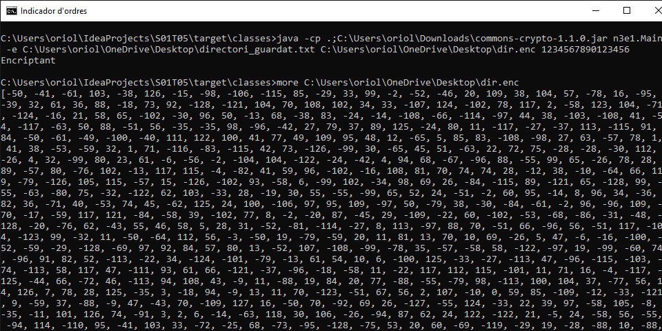

# Tasca 5 - Java Utils

## N1E1
L'argument entrat per terminal és el cami al directori a mostrar. L'argument es passa al mètode *mostrarDirectori* de la classe *GestorDirectorisV1*.
Exemple d'ús:

## N1E2
L'argument entrat per terminal és el camí al directori a mostrar. L'argument es passa al mètode *mostrarDirectoriComplet* de la classe *GestorDirectorisV2*. 
Exemple d'ús:

## N1E3
Al igual que en els casos anteriors, el primer argument és el directori a ensenyar. El segon argument estableix el nom del fitxer on es guardarà la informació del directori. Els arguments es passen al mètode *guardarDirectoriComplet* de la classe *GestorDirectorisV3*.
Exemple d'ús:

## N1E4
L'argument entrat per terminal és el fitxer el contingut del qual s'ha de mostrar. L'argument es passa al mètode *ensenyarFitxer* de la classe *GestorDirectorisV4*.
Exemple d'ús:

## N1E5
Es passen dos arguments. En primer lloc, un argument tipus flag (-s i -d per serialitzar i desserialitzat respectivament). El segon argument és un camí a fitxer, al qual es serialitzarà l'objecte (serialitzant) o del qual es carregarà l'objecte (desserialitzant).
Els arguments es passen al fitxer
Exemple d'ús: 

## N2E1
El primer argument és la localització del fitxer de propietats; el segon argument és el nom de la propietat que conté el camí del directori a guardar; el tercer argument és el camí del fitxer on es guardarà l'estructura del directori.
Exemple d'ús:

## N3E1

-e <fitxer original> <fitxer encriptat> <clau>
-d <fitxer original (encriptat)> <fitxer desencriptat> clau
Exemple d'ús:

